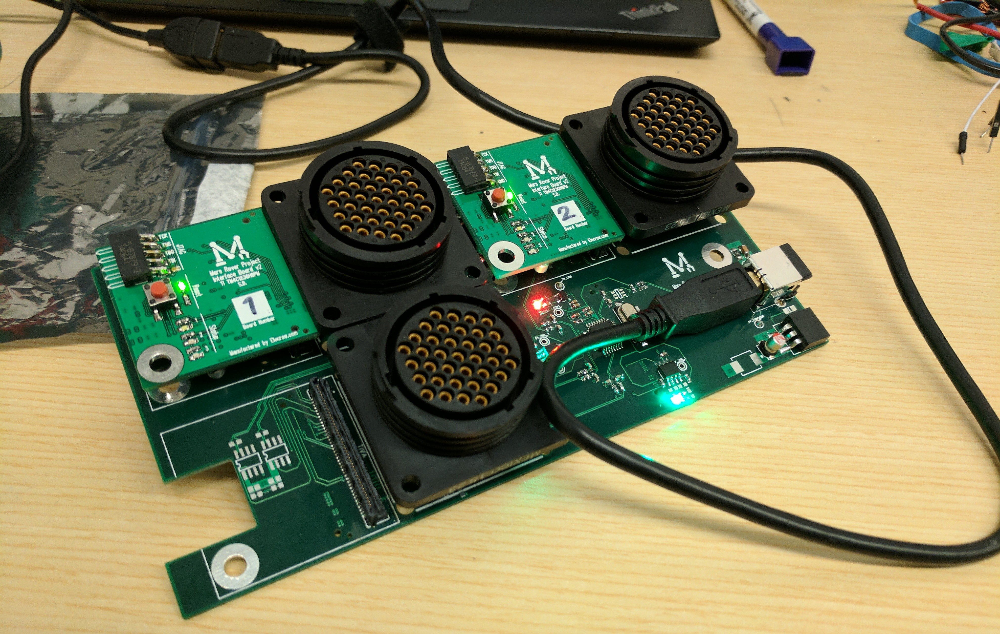

# Rover Tiva Microcontroller Code Submodule

This repository contains the complete TI TM4C microcontroller code for our 2017 rover, [Calliope](https://mcgillrobotics.com/rover/). Interactions between these microcontrollers and the rover's main computer take place over ROS topics.

## Rover Systems

The USB serial numbers assigned to each TM4C can be configured inside `usb_serial_structs.c`. This file is part of `rosserial_tivac`, but has been modified to allow us to configure our microcontroller's serial numbers based on a compiler flag.

### Arm

The arm system (pictured above) uses three TM4Cs connected through a USB-hub backplane to:

- Accept arm motor velocities and brake command over ROS topics
- Publish arm motor positions and velocities to ROS topics

There are three TM4Cs in the arm system:
- Shoulder (`arm_shoulder`)
- Elbow (`arm_elbow`)
- Wrist (`arm_wrist`)

The code for each TM4C is the same (`arm.cpp`), but each firmware binary is built with a different CMakeList, so that each microcontroller will have a different USB serial number.

### Drive

The drive system uses one TM4C to read the velocities of the rover's middle wheels, and publish these values on two ROS topics (`drive_middle`).

### Sampling

The sampling system (`sampling`) uses one TM4C to:
- Accept motor commands
- Publish motor velocities and positions
- Publish science sensor readings

## Setup Instructions

- Follow the `rosserial_tivac` setup instructions here: http://wiki.ros.org/rosserial_tivac/Tutorials/TivaWare%20Setup
- Be sure to install `rosserial_tivac` from source, not from the Ubuntu repo: https://github.com/vmatos/rosserial_tivac
- You may need to `cd` into your Tivaware directory and run `make`. Make sure you have the correct version of the ARM gcc compiler installed
- Copy `71-rover-tiva.rules` to `/etc/udev/rules.d/` and refresh the udev rules (you could do this by rebooting)

## Running Instructions

- When you plug in the arm backplane, `/dev` should contain `arm_shoulder`, `arm_elbow`, and `arm_wrist` symlinks
- `roscd` and run `roslaunch rover_tiva arm.launch`
- Subscribe/publish to appropriate topics
  - `motor_shoulder_a`: Publish motor commands to these topics (velocities from -4000 to 4000)
  - `inc_shoulder_a`: Subscribe to incremental encoder readings from these topics
  - `abs_shoulder_a`: Subscribe to absolute encoder readings from these topics

## Reset Motors

- Running the launch file will now also start up a reset server on /arm_motor_reset_server. In order to reset a joint (resets all motors at that joint), run `rosservice call /arm_motor_reset_server "motor_shoulder_reset"`, or whichever joint you care to reset (other options are `"motor_elbow_reset"` and `"motor_wrist_reset"`).

## Brake Motors

- Running the launch file also start up a brake server on /arm_motor_brake_server. Brake a joint (motor_a, motor_b, and if appropriate motor_c) with `rosservice call /arm_motor_brake_server "motor_shoulder_brake"`, or whichever joint you care to reset (other options are `"motor_elbow_brake"` and `"motor_wrist_brake"`).

## Flashing Instructions

- Connect a Tiva Launchpad's JTAG pins (`TCK`, `TMS`, `TDI`, `TDO`, `GND`) to the custom Tiva's header. Be sure to disconnect the `VDD` jumper on the Launchpad.
- Power on the backplane by plugging it into a computer. All green and red LEDs should be on
- `roscd` and run `catkin_make rover_tiva_arm_shoulder_flash`, or similar for the other joints

# Maintenance instructions

Let's say you want to add a completely new Tiva to the system. You would need to:

- Update the top level and inner CMakeLists to add its code to the build
- Give it its own serial number in `usb_serial_structs.c` and symlink both `usb_serial_structs` files into the Tiva's directory
- Update/create a udev rule to allow it to enumerate
- Add it to the launch file, or create another launch file

You should be able to do all that by looking at the code for the other Tivas

# Notes

- The shoulder and elbow Tivas drive 2 motors each, but the wrist Tiva drives 3 motors (including the claw)
- Plugging the backplane into a DC power source is not sufficient to power it on. Its internal USB hub must handshake with a computer's USB port before it will turn on the Tivas
- Remember, all the files inside the `arm_shoulder`, `arm_elbow`, and `arm_wrist` directories are symlinked together. The only actual files in those directories are the `CMakeLists.txt`. Compile-time defines generate the individual firmware for each Tiva
- If you want to manually blank a Tiva, you can run `lm4flash /dev/null`
- If you look in your kernel logs (`dmesg -wH`) you'll see that one of the USB ports on the backplane is reporting an overcurrent condition. This is normal, I just forgot to pull down the overcurrent pin on thehub's unused USB port
- Tivas with no serial number specified will be given the serial number `00000000`. The last udev rule in `71-rover-tiva.rules` will give those Tivas the symlink `tiva%n` where `%n` is an integer chosen by your computer
- Relevant page about the Tivas' VID and PID. Hopefully we will get registered in Ubuntu's USB ID database: https://github.com/mcgill-robotics/electrical/wiki/McGill-Robotics-USB-PID-for-TM4C-Microcontrollers
